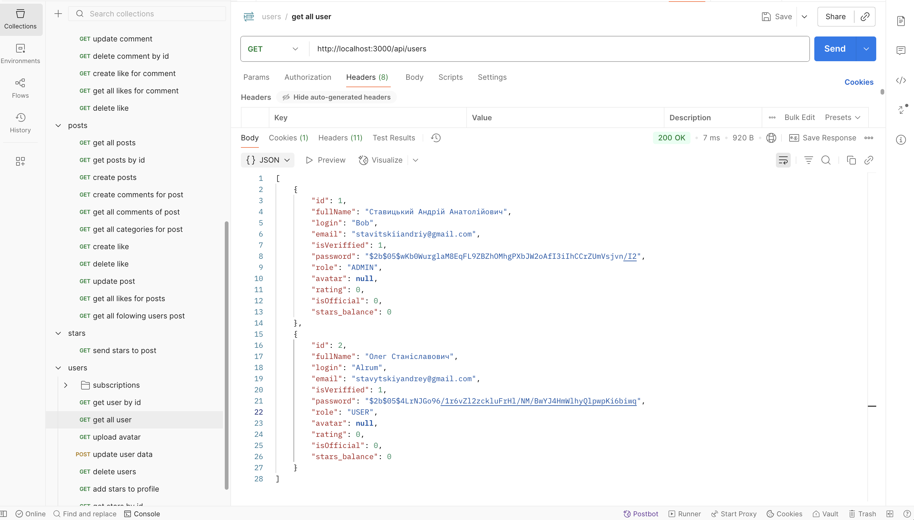
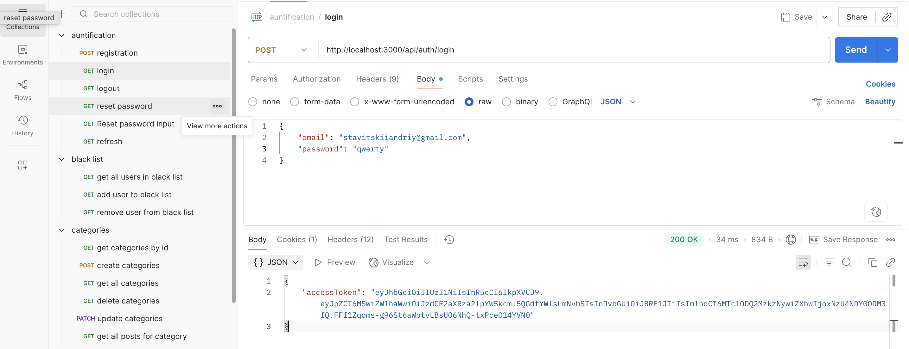
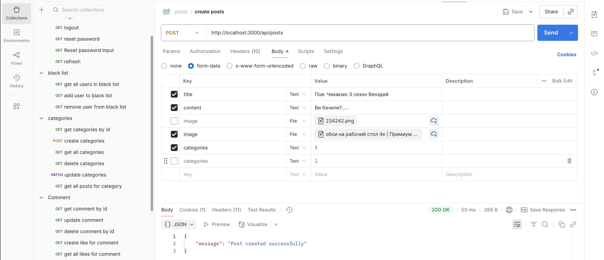

# Usof-backend

## Short Description

Usof-backend is a web backend project developed as part of the Innovation Campus training program. It provides RESTful APIs for user management, authentication, and other core features for a modern web application.

## Screenshots

Below are some screenshots demonstrating the backend in use (API responses via Postman):





*Screenshots are located in the `screenshots/` folder.*

## Requirements and Dependencies

- Node.js (v18 or higher)
- npm (v9 or higher)
- MongoDB (local or cloud instance)
- [Optional] Postman for API testing

Main dependencies (see `package.json` for full list):
- express
- mongoose
- dotenv
- jsonwebtoken
- bcryptjs

## How to Run

1. **Clone the repository:**
   ```bash
   git clone https://github.com/yourusername/Usof-backend.git
   cd Usof-backend
   ```

2. **Install dependencies:**
   ```bash
   npm install
   ```

3. **Configure environment variables:**
   - Copy `.env.example` to `.env` and fill in your MongoDB URI and JWT secret.

4. **Start MongoDB:**
   - Make sure your MongoDB server is running locally or update the URI for a cloud instance.

5. **Run the backend server:**
   ```bash
   npm start
   ```

6. **Test the API:**
   - Use Postman or any API client to interact with endpoints (see API documentation).

---

> _This project was developed as part of the training program at Innovation Campus._
