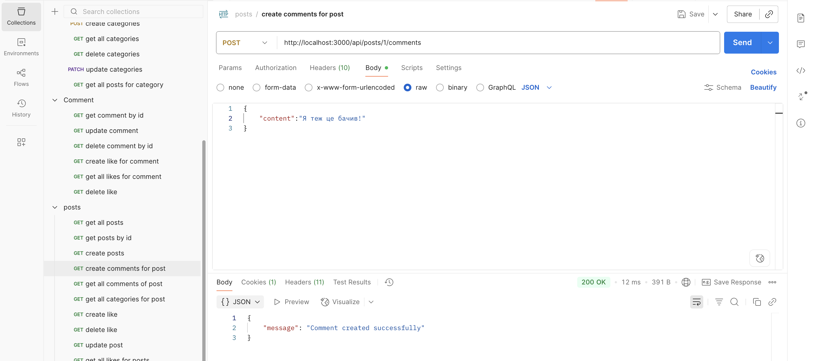

# Usof-backend

## Short Description

Usof-backend is a backend project developed as part of the **Innovation Campus** training program.  
It provides RESTful APIs for **user management, authentication, posts, comments, likes, followers, and rating system**, forming the foundation for a modern forum-like application.

---

## Screenshots

Below are some screenshots demonstrating the API responses in Postman:

  
  
  
  

*Screenshots are located in the `screenshots/` folder.*

---

## Requirements and Dependencies

- **Node.js** (v18 or higher)  
- **npm** (v9 or higher)  
- **MySQL** (local or remote instance)  
- [Optional] **Postman** for API testing  

Main dependencies (see `package.json` for full list):  
- express  
- mysql2  
- dotenv  
- jsonwebtoken  
- bcryptjs  

---

## How to Run

1. **Clone the repository:**
   ```bash
   git clone https://github.com/yourusername/Usof-backend.git
   cd Usof-backend
   ```

2. **Install dependencies:**
   ```bash
   npm install
   ```

3. **Configure environment variables:**
   - Copy `.env.example` to `.env` and fill in your values.

4. **Start MySQL:**
   - Make sure your MySQL server is running and accessible.

5. **Run the backend server:**
   ```bash
   npm start
   ```

6. **Test the API:**
   - Use Postman or any API client to interact with endpoints.

---

## API Overview

### Auth API
- `POST /api/auth/register` – register new user
- `POST /api/auth/login` – login and get JWT tokens
- `POST /api/auth/logout` – logout (invalidate refresh token)
- `POST /api/auth/refresh` – refresh access token

### User API
- `GET /api/users` – get all users (admin only)
- `GET /api/users/:user_id` – get user by id
- `POST /api/users` – create user (admin only)
- `PATCH /api/users/:user_id` – update user (admin only)
- `DELETE /api/users/:user_id` – delete user (admin only)
- `PATCH /api/users/avatar` – upload avatar (authorized user)
- `GET /api/users/:user_id/stars` – get stars
- `POST /api/users/stars` – add stars
- `POST /api/users/:user_id/follow` – follow user
- `DELETE /api/users/:user_id/unfollow` – unfollow user
- `GET /api/users/:user_id/followers` – get followers
- `GET /api/users/:user_id/following` – get following
- `GET /api/users/:user_id/rating` – get user rating

### Post API
- `GET /api/posts` – get all posts (with pagination/sorting)
- `GET /api/posts/:post_id` – get post by id
- `POST /api/posts` – create new post (authorized user)
- `PATCH /api/posts/:post_id` – update post (owner or admin)
- `DELETE /api/posts/:post_id` – delete post (owner or admin)
- `POST /api/posts/:post_id/like` – like post
- `GET /api/posts/:post_id/like` – get all likes for post

### Comment API
- `GET /api/comments/:comment_id` – get comment by id
- `POST /api/posts/:post_id/comments` – create comment under post
- `PATCH /api/comments/:comment_id` – update comment (owner or admin)
- `DELETE /api/comments/:comment_id` – delete comment (owner or admin)
- `POST /api/comments/:comment_id/like` – like comment
- `GET /api/comments/:comment_id/like` – get all likes for comment

---

## Project Status

This project is under active development as part of the **Innovation Campus** program.
