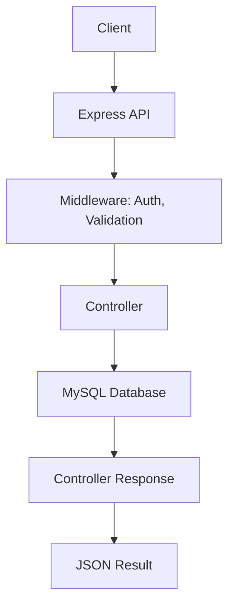

# Usof-backend Documentation

## 1. Introduction
- **Project name:** Usof-backend  
- **Goal of the project:** Backend для форумної платформи з користувачами, постами, коментарями, авторизацією, лайками, підписниками та рейтингами.  
- **Technologies used:** Node.js, Express.js, MySQL, JWT, bcrypt, multer  
- **Author:** Андрій  
- **Context:** Проект створено в рамках навчання в Innovation Campus.

---

## 2. Development Progress (CBL Stages)

### Stage 1 — Database and Basic Setup
- **What was implemented:**  
  - Створено таблиці `users`, `posts`, `comments`, `likes`, `followers`, `ratings`.  
  - Реалізовано базове підключення до MySQL через `mysql2`.  
- **Difficulties faced:** Конфлікти типів при створенні foreign keys, зв'язки між таблицями.  
- **Solutions:** Використав `ON DELETE CASCADE` для коректного видалення залежних даних, перевірка типів.

### Stage 2 — User Authentication
- **What was implemented:**  
  - Реєстрація та авторизація з хешуванням паролів (`bcrypt`).  
  - JWT з access і refresh токенами.  
- **Difficulties faced:** Зберігання та відкликання refresh токенів.  
- **Solutions:** Зберігання у БД, видалення при logout.

### Stage 3 — Posts, Comments, Likes, Followers
- **What was implemented:**  
  - CRUD для постів і коментарів.  
  - Лайки для постів і коментарів.  
  - Підписка/відписка на користувачів.  
- **Difficulties faced:** Перевірка прав доступу, унікальність лайків/підписок.  
- **Solutions:** Middleware для ролей, унікальні ключі для лайків/підписок.

### Stage 4 — Rating System, Pagination, Search
- **What was implemented:**  
  - Рейтинг користувачів.  
  - Пошук користувачів та постів (`LIKE %search%`).  
  - Пагінація (`LIMIT`, `OFFSET`).  
  - Сортування за рейтингом.  
- **Difficulties faced:** SQL помилки з OFFSET/LIMIT, підрахунок рейтингу.  
- **Solutions:** Перевірка параметрів, оптимізація запитів.

---

## 3. Algorithm of the Program

### General Workflow
1. Користувач надсилає запит (frontend або Postman).
2. Middleware перевіряє JWT (авторизація).
3. Контролер виконує бізнес-логіку.
4. Сервіс/модель звертається до бази даних.
5. Відповідь повертається у форматі JSON.

### Diagram

---

## 4. Database Structure

  

---

## 5. Technical Details

- **Architecture pattern:** MVC (Controllers + Models + Routes)
- **Authentication:** JWT (access 15 min, refresh довший, зберігається в БД)
- **Error handling:** Custom ApiError + middleware
- **File upload:** multer для аватарів
- **Pagination & Sorting:** SQL LIMIT, OFFSET, ORDER BY
- **Search:** SQL LIKE по fullName, title

---

## 6. Testing & Debugging

- **Tools:** Postman
- **Examples of requests:**
  - `POST /api/auth/register` → реєстрація нового користувача
  - `POST /api/auth/login` → повертає access + refresh JWT
  - `GET /api/users?search=John` → пошук користувачів
  - `GET /api/posts?page=1&limit=5` → пагінація постів
  - `POST /api/comments/:postId` → додавання коментаря
  - `POST /api/posts/:postId/like` → лайк поста
  - `POST /api/comments/:commentId/like` → лайк коментаря
  - `POST /api/users/:userId/follow` → підписка на користувача

---

## 7. Conclusions

**Successfully implemented:**
- Авторизація через JWT
- CRUD для користувачів, постів, коментарів
- Лайки, підписки, рейтинг
- Пошук, сортування, пагінація

**Remaining challenges:**
- Оптимізація складних SQL-запитів
- Тести (unit + integration)

**Future improvements:**
- Кешування запитів
- Вебсокети для live-коментарів
- Документація API через Swagger
